<a name="english"></a>

<div align="center">

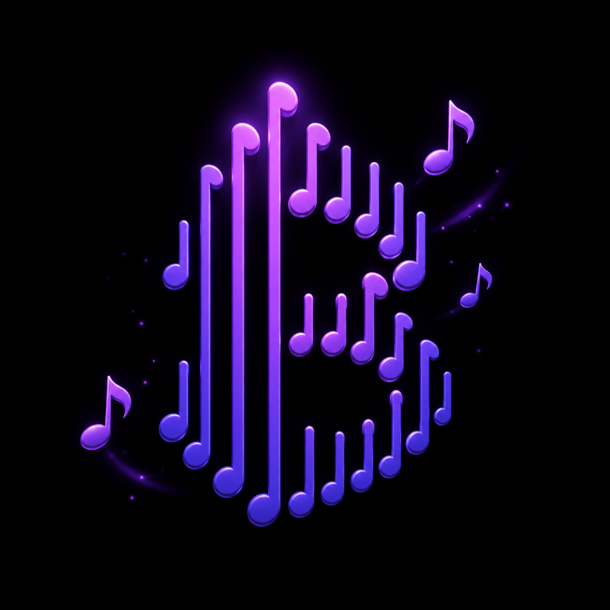

# BioBand

**Five instruments in your pocket — and a studio to put them together.**

Piano, drums, guitar, violin and pads with real sampled sound, a step-sequenced
drum machine, guided tutorials, multi-track recording, and progress tracking.
Works fully offline.

[](https://github.com/bilalgurkansanli/BioBand/actions/workflows/ci.yml)
[](https://docs.expo.dev/versions/v54.0.0/)
[](https://reactnative.dev)
[](tsconfig.json)
[](LICENSE)

**English** ·
[](#türkçe) ·
[](#deutsch)

</div>

---

## Demo

<!--
  ─────────────────────────────────────────────────────────────────────────
  DEMO VIDEO — pick whichever is easier:

  1. MP4 (gives a real player, best quality)
     Open a new issue in this repo, drag the .mp4 into the comment box, wait
     for the upload to finish, and copy the `https://github.com/user-attachments/...`
     URL it produces. Paste that URL below **on its own line** — bare, not
     wrapped in markdown link syntax, which is what makes GitHub render a
     player. Then close the issue without submitting it.

  2. GIF (plays inline everywhere, including on mirrors)
     Save it as `docs/demo.gif` and replace this whole block with:
     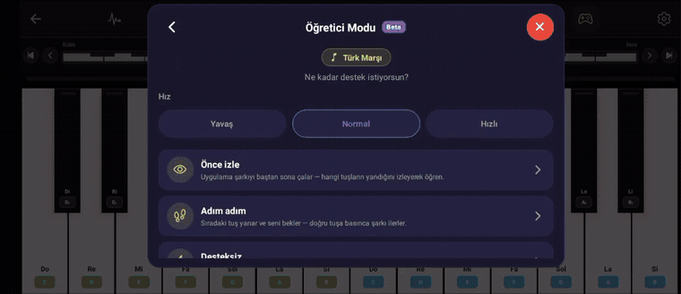
  ─────────────────────────────────────────────────────────────────────────
-->

> **📹 Demo video goes here.** The two ways to add it are written in an HTML
> comment in the source of this section.

## Screenshots

<table>
  <tr>
    <td align="center" width="33%">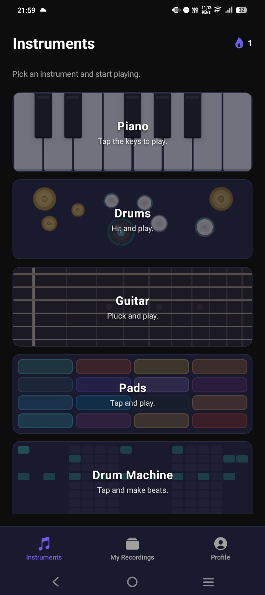<br><sub><b>Instruments</b></sub></td>
    <td align="center" width="33%">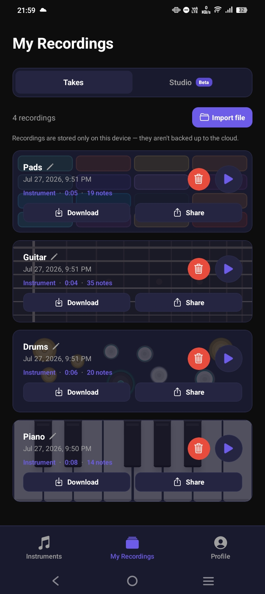<br><sub><b>Recordings</b></sub></td>
    <td align="center" width="33%">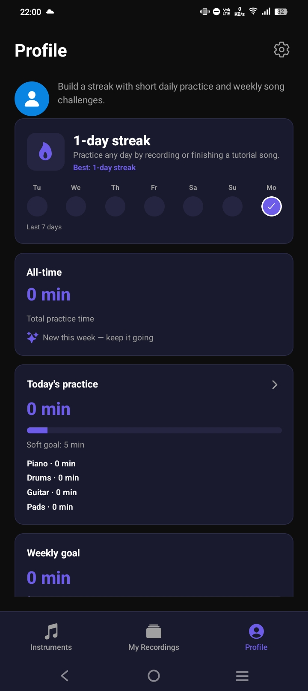<br><sub><b>Profile &amp; streaks</b></sub></td>
  </tr>
</table>

<table>
  <tr>
    <td align="center" width="50%">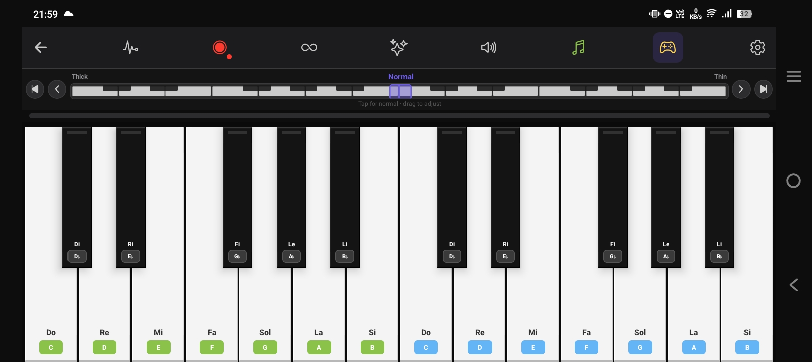<br><sub><b>Piano</b></sub></td>
    <td align="center" width="50%">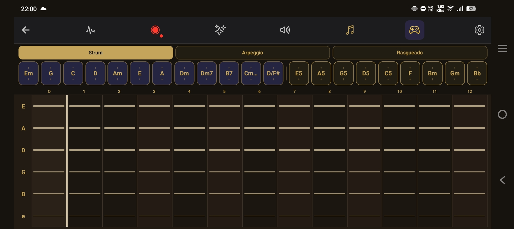<br><sub><b>Guitar</b></sub></td>
  </tr>
  <tr>
    <td align="center">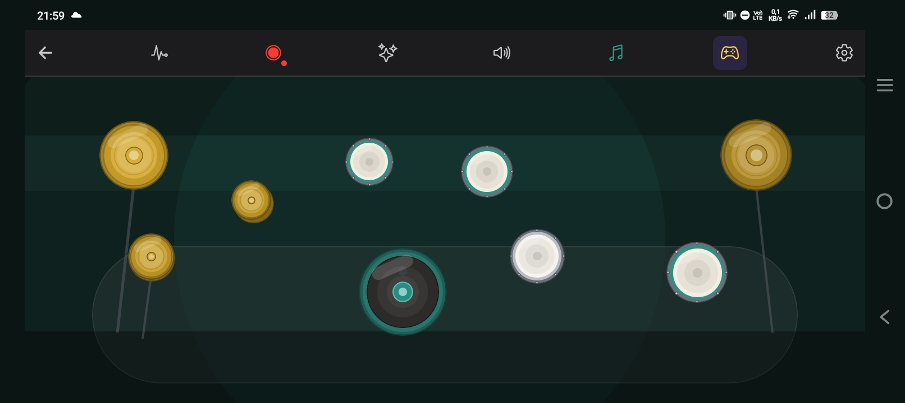<br><sub><b>Drums</b></sub></td>
    <td align="center">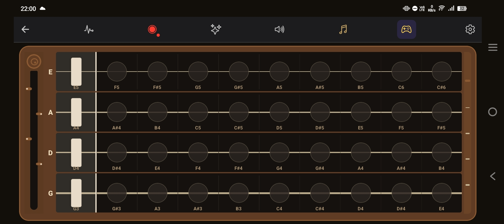<br><sub><b>Violin</b></sub></td>
  </tr>
  <tr>
    <td align="center">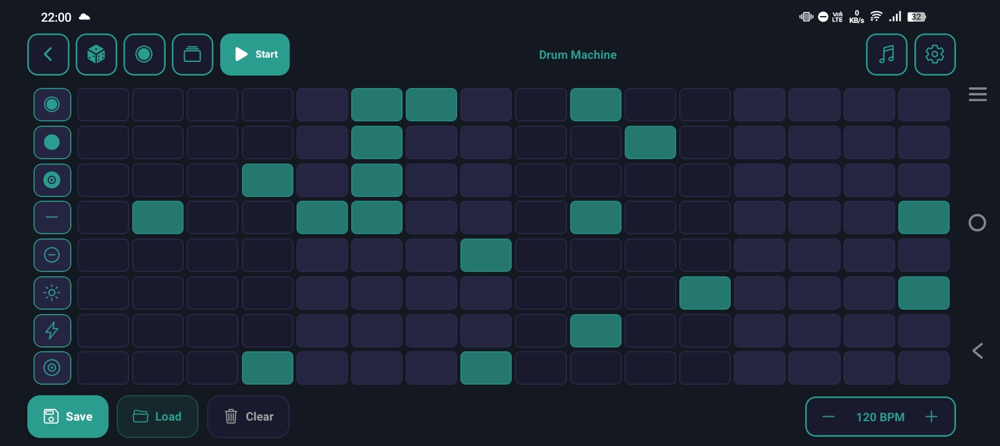<br><sub><b>Drum Machine</b></sub></td>
    <td align="center">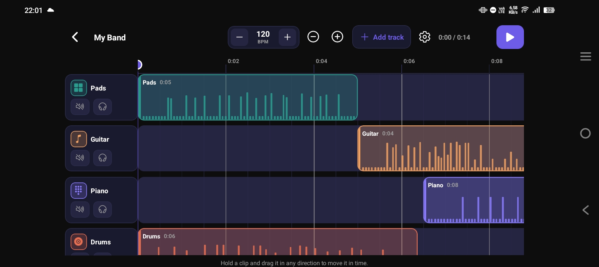<br><sub><b>Studio</b></sub></td>
  </tr>
</table>

<sub>Captured on a phone, unedited. The same shots dressed for the stores are
built by <a href="scripts/store_screenshots.py">scripts/store_screenshots.py</a>;
see <a href="docs/screenshots/raw/">docs/screenshots/raw/</a>.</sub>

## Features

**Instruments** — Piano (24 keys, C4–B5), Drums, Guitar, Violin and Pads, each
with several voices or kits, its own tone shaping, and sample-accurate playback.
Plus a step-sequenced Drum Machine with pattern save/load.

**Tutorial Mode** — a guided play-along on every instrument. Notes light up in
time with the music; play at your own speed or watch it play itself. Songs are
stored as timed events, so note length and phrasing are real rather than a
uniform metronome grid.

**Bring your own songs** — import a `.mid` file or a JSON chart and it becomes a
playable tutorial. The importer reads the tempo map and time signature, splits
bass from chords, de-jitters human timing, and transposes the piece to fit the
keyboard instead of folding stray notes into the wrong octave.

**Studio** — multi-track timeline with per-track volume, mute/solo, clip
dragging, snap-to-grid, tempo and metronome. Overdub a new take straight from
any instrument, then bounce the mix to a single file.

**Recordings** — every take in one place: play back with a scrubber, rename,
download to a folder you pick, or send it through the system share sheet.

**Progress** — practice streaks, total practice time, badges, and optional
practice reminders.

**Offline-first** — every sample and song ships inside the app. Nothing is
downloaded at runtime, and in guest mode nothing leaves the device. Signing in
with Google or Apple additionally syncs progress and settings through Supabase,
guarded by Postgres Row Level Security.

**Localised** — English, Turkish, German.

## How it works

A few decisions that shaped the codebase. The full write-up is in
[`docs/ARCHITECTURE.md`](docs/ARCHITECTURE.md).

**Notes are scheduled on the audio clock, not on `setTimeout`.**
JavaScript timers drift and stall behind rendering; a song scheduled with them
sounds fine at first and falls apart under load. Instead a 25 ms tick looks
120 ms ahead and hands each note to the audio engine with an absolute start
time, so timing is decided by the audio hardware's clock.
→ [`src/audio/songScheduler.ts`](src/audio/songScheduler.ts)

**Samples are never stretched far.**
Each instrument keeps anchor recordings a few semitones apart and repitches to
the nearest one, so no note is stretched more than about two semitones. Past
that a sampled piano starts to sound like a synthesiser.
→ [`src/instruments/piano/pianoSamples.ts`](src/instruments/piano/pianoSamples.ts)

**Export renders offline, not in real time.**
An instrument take is stored as note events, so exporting it re-renders the
performance through an `OfflineAudioContext` much faster than real time, then
encodes. The encoder is sliced and awaited between blocks — it runs on the same
thread that draws the UI, and a one-shot encode of a long take freezes the app
outright.
→ [`src/audio/offlineBounce.ts`](src/audio/offlineBounce.ts),
[`src/audio/pcmEncode.ts`](src/audio/pcmEncode.ts)

**Songs are transposed whole, never folded.**
The piano exposes 24 keys. A song that wanders outside them is shifted as a
whole so its shape survives; folding individual notes back into range keeps
every pitch "correct" while destroying the melody's contour.
→ [`src/instruments/piano/songs/midiToSong.ts`](src/instruments/piano/songs/midiToSong.ts)

**Instruments warm up before the app opens.**
The first screen is the instrument list, so tapping an instrument has to make
sound immediately. Every engine decodes its samples behind the launch screen
rather than on first focus.
→ [`src/audio/preloadInstruments.ts`](src/audio/preloadInstruments.ts)

## Getting started

### Requirements

- Node.js 20+
- Android Studio or Xcode for the platform you target
- BioBand uses native audio modules, so it needs a **dev client build** — it
  does not run in Expo Go
- Optional: a [Supabase](https://supabase.com) project, only for sign-in and
  cloud sync

### Run it

```bash
git clone https://github.com/bilalgurkansanli/BioBand.git
cd BioBand
npm install
npm run android          # or: npm run ios
```

Without a `.env` the app runs fully in guest mode: every instrument, song,
recording and Studio feature works — only sign-in and cloud sync are disabled.

### Optional: cloud sync

1. Create a Supabase project and run [`supabase/schema.sql`](supabase/schema.sql)
   once in its SQL Editor. That creates the `app_data` table and its Row Level
   Security policies.
2. `cp .env.example .env` and fill in your own values;
   [`.env.example`](.env.example) documents where each one is found.
3. Replace the OAuth client ID in [`app.json`](app.json) (`plugins` →
   `@react-native-google-signin/google-signin` → `iosUrlScheme`) plus the
   `owner` and `extra.eas.projectId` fields with your own.

> OAuth client IDs and the Supabase anon key are public client-side values by
> design — they ship inside every app binary. Access is enforced by Row Level
> Security, not by keeping them secret. Never put a `service_role` key in this
> project.

## Project layout

```
src/
├── audio/            shared audio layer — context, sample bank, scheduler,
│                     offline bounce, encoders, preloading
├── instruments/      one folder per instrument: engine, voices, samples, songs
│   └── shared/       cross-instrument performance and rhythm helpers
├── components/       UI, grouped by instrument and feature
├── screens/          one screen per route
├── hooks/            engine bindings, play-along, recording, orientation
├── storage/          AsyncStorage persistence
├── supabase/         optional cloud sync client
├── profile/          streaks, practice time, badges
├── i18n/             en / tr / de catalogues
└── types/            shared domain types

assets/samples/       the instrument recordings (mp3 / wav)
docs/                 architecture notes and screenshots
supabase/schema.sql   database schema and RLS policies
```

## Scripts

| Command | What it does |
| --- | --- |
| `npm start` | Start the Metro bundler |
| `npm run android` / `npm run ios` | Build and launch a dev client |
| `npm run typecheck` | `tsc --noEmit` |
| `npm run lint` | ESLint |
| `npm run check` | Typecheck + lint — the same pair CI runs |
| `npm run doctor` | `expo-doctor` project health check |

## Known trade-offs

Things that are true today, so you don't have to discover them the hard way:

- **Launch decodes a lot of audio.** All five engines warm up before the app
  opens — around 7 minutes of audio across 116 files, roughly 79 MB in memory.
  Several sample tails run far longer than any envelope reaches, so there is
  real headroom here.
- **Instrument-mode exports are MP3, not MP4.** Microphone takes are already
  AAC-in-MP4 and are exported as-is, but a rendered instrument take has to be
  encoded and there is no AAC encoder available in JavaScript. True MP4
  everywhere needs a small native module.
- **No automated test suite yet.** Audio behaviour has been checked by
  measurement — rendering charts to PCM and asserting timing, contour and range
  in Node — rather than by a committed suite. Contributions welcome.
- **Long MIDI imports are truncated** at a fixed note cap without telling the
  user.

## Contributing

Issues and pull requests are welcome — [CONTRIBUTING.md](CONTRIBUTING.md) covers
setup, what CI checks, and what makes a change easy to review. By taking part
you agree to the [Code of Conduct](CODE_OF_CONDUCT.md).

Found a security problem? Please follow [SECURITY.md](SECURITY.md) rather than
opening a public issue.

## Privacy

BioBand keeps your recordings and progress on your device. Nothing is uploaded
unless you sign in. Full policy: [PRIVACY.md](PRIVACY.md).

Signed in and want out? Profile → Settings → Delete account removes everything
immediately; [`docs/account-deletion.md`](docs/account-deletion.md) covers what
is deleted and how to request it without installing the app.

## Credits

Public-domain sheet music for the classical tutorials comes from the
[Mutopia Project](https://www.mutopiaproject.org/). Instrument samples are
bundled with the app; per-instrument notes live alongside them in
[`assets/samples/`](assets/samples).

## License

[MIT](LICENSE) © Bilal Gürkan Şanlı

---

<a name="türkçe"></a><a name="turkce"></a>

## Türkçe

<sub>🇹🇷 · [⬆ English](#english) · [Deutsch](#deutsch)</sub>

**Cebinde beş enstrüman — ve hepsini bir araya getirecek bir stüdyo.**

Piyano, davul, gitar, keman ve pad'ler; hepsi gerçek kayıtlardan alınmış seslerle.
Adım adım programlanan bir davul makinesi, rehberli dersler, çok kanallı kayıt ve
ilerleme takibi. Tamamen çevrimdışı çalışır.

### Özellikler

**Enstrümanlar** — Piyano (24 tuş, C4–B5), Davul, Gitar, Keman ve Pad'ler. Her
birinin birden fazla sesi veya kiti, kendine ait ton ayarları ve örnek
hassasiyetinde çalma motoru var. Ayrıca desen kaydedip yükleyebildiğin bir Davul
Makinesi.

**Eğitici Mod** — her enstrümanda rehberli çalma. Notalar müzikle birlikte
yanıyor; kendi hızında çalabilir ya da kendi kendine çalmasını izleyebilirsin.
Şarkılar zamanlanmış olaylar olarak saklandığı için nota süreleri ve ifade
gerçek — tekdüze bir metronom ızgarası değil.

**Kendi şarkılarını getir** — bir `.mid` dosyası ya da JSON nota çizelgesi
aktarırsın, çalınabilir bir derse dönüşür. Aktarıcı tempo haritasını ve ölçü
sayısını okur, bası akorlardan ayırır, insan çalışındaki sapmaları düzeltir ve
parçayı klavyeye sığdırmak için bütün hâlinde transpoze eder — tek tek notaları
yanlış oktava katlamak yerine.

**Studio** — çok kanallı zaman çizelgesi: kanal başına ses seviyesi, sustur/yalnız
çal, klip sürükleme, ızgaraya yapışma, tempo ve metronom. Herhangi bir
enstrümandan doğrudan yeni bir kayıt üstüne ekleyip mix'i tek dosyaya
indirebilirsin.

**Kayıtlarım** — bütün kayıtların tek yerde: sürgüyle oynat, yeniden adlandır,
seçtiğin bir klasöre indir ya da sistemin paylaşım menüsüyle gönder.

**İlerleme** — çalışma serileri, toplam çalışma süresi, rozetler ve isteğe bağlı
çalışma hatırlatmaları.

**Önce çevrimdışı** — bütün sesler ve şarkılar uygulamanın içinde geliyor.
Çalışma sırasında hiçbir şey indirilmiyor, konuk modunda hiçbir şey cihazdan
çıkmıyor. Google veya Apple ile giriş yaparsan ilerlemen ve ayarların ayrıca
Supabase üzerinden senkronlanır; Postgres Row Level Security ile korunur.

**Çok dilli** — İngilizce, Türkçe, Almanca.

### Nasıl çalışıyor

Kod tabanını şekillendiren birkaç karar. Tamamı
[`docs/ARCHITECTURE.md`](docs/ARCHITECTURE.md) içinde.

**Notalar `setTimeout` ile değil, ses saatiyle planlanıyor.** JavaScript
zamanlayıcıları kayar ve arayüz çizimi arkasında takılır; onlarla planlanmış bir
şarkı başta iyi duyulur, yük altında dağılır. Bunun yerine 25 ms'lik bir tik
120 ms ileriye bakıyor ve her notayı ses motoruna **mutlak** bir başlangıç
zamanıyla veriyor — yani zamanlamaya ses donanımının saati karar veriyor.
→ [`src/audio/songScheduler.ts`](src/audio/songScheduler.ts)

**Ses örnekleri asla fazla esnetilmiyor.** Her enstrüman birkaç yarım ses arayla
çapa kayıtları tutuyor ve en yakınına göre perde kaydırıyor; böylece hiçbir nota
iki yarım sesten fazla esnetilmiyor. Bunun ötesinde örneklenmiş bir piyano
synthesizer gibi duyulmaya başlıyor.
→ [`src/instruments/piano/pianoSamples.ts`](src/instruments/piano/pianoSamples.ts)

**Dışa aktarma gerçek zamanlı değil, çevrimdışı işleniyor.** Enstrüman kaydı nota
olayları olarak saklandığı için, dışa aktarırken performans bir
`OfflineAudioContext` üzerinden gerçek zamandan çok daha hızlı yeniden
üretiliyor. Kodlayıcı bloklar arasında dilimlenip bekletiliyor — çünkü arayüzü
çizen iş parçacığında çalışıyor ve uzun bir kaydı tek seferde kodlamak uygulamayı
dondurur.
→ [`src/audio/offlineBounce.ts`](src/audio/offlineBounce.ts)

**Şarkılar bütün hâlinde transpoze ediliyor, katlanmıyor.** Piyanoda 24 tuş var.
Dışına taşan bir şarkı bütün olarak kaydırılıyor ki şekli bozulmasın; notaları
tek tek aralığa geri katlamak her perdeyi "doğru" tutarken melodinin çizgisini
yok eder.
→ [`src/instruments/piano/songs/midiToSong.ts`](src/instruments/piano/songs/midiToSong.ts)

**Enstrümanlar uygulama açılmadan ısınıyor.** İlk ekran enstrüman listesi olduğu
için, bir enstrümana dokunulduğunda anında ses çıkması gerekiyor. Her motor
örneklerini ilk odaklanmada değil, açılış ekranının arkasında çözüyor.
→ [`src/audio/preloadInstruments.ts`](src/audio/preloadInstruments.ts)

### Başlarken

**Gerekenler:** Node.js 20+, hedeflediğin platform için Android Studio veya
Xcode. BioBand yerel ses modülleri kullanıyor, bu yüzden **dev client build**
gerekiyor — Expo Go'da çalışmaz. Supabase projesi isteğe bağlı; sadece giriş ve
bulut senkronu için.

```bash
git clone https://github.com/bilalgurkansanli/BioBand.git
cd BioBand
npm install
npm run android          # veya: npm run ios
```

`.env` olmadan uygulama tamamen konuk modunda çalışır: her enstrüman, şarkı,
kayıt ve Studio özelliği çalışır — sadece giriş ve bulut senkronu kapalıdır.

Bulut senkronu için: bir Supabase projesi açıp
[`supabase/schema.sql`](supabase/schema.sql) dosyasını SQL Editor'de bir kez
çalıştır, `cp .env.example .env` yapıp kendi değerlerini gir, ve
[`app.json`](app.json) içindeki OAuth istemci kimliğiyle `owner` /
`extra.eas.projectId` alanlarını kendininkilerle değiştir.

> OAuth istemci kimlikleri ve Supabase anon anahtarı tasarım gereği istemci
> tarafında açık değerlerdir — her uygulama paketinin içinde zaten bulunurlar.
> Erişimi gizlilikleri değil, Row Level Security korur. Bu projeye asla bir
> `service_role` anahtarı koyma.

### Bilinen ödünler

- **Açılışta çok fazla ses çözülüyor.** Beş motor da uygulama açılmadan ısınıyor
  — 116 dosyada yaklaşık 7 dakikalık ses, bellekte kabaca 79 MB.
- **Enstrüman kayıtları MP3 olarak dışa aktarılıyor, MP4 değil.** Mikrofon
  kayıtları zaten AAC-in-MP4 ve olduğu gibi aktarılıyor; JavaScript'te AAC
  kodlayıcı olmadığı için işlenmiş enstrüman kaydı MP3'e çevriliyor.
- **Henüz otomatik test paketi yok.** Ses davranışı ölçümle doğrulandı —
  Node'da nota çizelgelerini PCM'e işleyip zamanlama, çizgi ve aralık
  sınanarak — ama depoya işlenmiş bir paket hâlinde değil.
- **Uzun MIDI aktarımları** sabit bir nota sınırında, kullanıcıya söylenmeden
  kesiliyor.

### Gizlilik

BioBand kayıtlarını ve ilerlemeni cihazında tutar. Giriş yapmadıkça hiçbir şey
yüklenmez. Tam metin: [PRIVACY.md](PRIVACY.md).

Giriş yaptın ve çıkmak mı istiyorsun? Profil → Ayarlar → Hesabı sil her şeyi
anında kaldırır;
[`docs/account-deletion.md`](docs/account-deletion.md) neyin silindiğini ve
uygulamayı kurmadan nasıl talep edeceğini anlatır.

### Katkı ve lisans

Konu bildirimleri ve pull request'ler açığa hoş geldiniz —
[CONTRIBUTING.md](CONTRIBUTING.md) kurulumu, CI'ın neyi kontrol ettiğini ve bir
değişikliği incelemesi kolay kılan şeyleri anlatıyor. Katılarak
[Davranış Kuralları](CODE_OF_CONDUCT.md)'nı kabul etmiş olursun. Güvenlik açığı
bulduysan herkese açık bir konu açmak yerine [SECURITY.md](SECURITY.md)'yi
izle.

Lisans: [MIT](LICENSE) © Bilal Gürkan Şanlı

---

<a name="deutsch"></a>

## Deutsch

<sub>🇩🇪 · [⬆ English](#english) · [Türkçe](#türkçe)</sub>

**Fünf Instrumente in deiner Tasche — und ein Studio, um sie zusammenzubringen.**

Klavier, Schlagzeug, Gitarre, Geige und Pads, alle mit echten gesampelten
Klängen. Dazu ein Step-Sequencer-Drumcomputer, geführte Lektionen,
Mehrspuraufnahme und Fortschrittsverfolgung. Funktioniert vollständig offline.

### Funktionen

**Instrumente** — Klavier (24 Tasten, C4–B5), Schlagzeug, Gitarre, Geige und
Pads, jeweils mit mehreren Klangfarben oder Kits, eigener Klangformung und
sample-genauer Wiedergabe. Dazu ein Drumcomputer mit Step-Sequencer und
Speichern/Laden von Patterns.

**Lernmodus** — geführtes Mitspielen auf jedem Instrument. Die Noten leuchten im
Takt der Musik auf; spiele in deinem eigenen Tempo oder sieh zu, wie das Stück
sich selbst spielt. Songs werden als zeitgesteuerte Ereignisse gespeichert,
Notenlängen und Phrasierung sind also echt statt eines gleichförmigen
Metronomrasters.

**Eigene Songs mitbringen** — importiere eine `.mid`-Datei oder ein
JSON-Notenblatt, und daraus wird eine spielbare Lektion. Der Import liest
Tempokurve und Taktart, trennt Bass von Akkorden, glättet menschliche
Timing-Schwankungen und transponiert das Stück als Ganzes auf die Tastatur,
statt einzelne Noten in die falsche Oktave zu falten.

**Studio** — Mehrspur-Timeline mit Lautstärke pro Spur, Stumm/Solo, Verschieben
von Clips, Raster-Einrasten, Tempo und Metronom. Nimm direkt aus jedem
Instrument eine weitere Spur auf und exportiere den Mix als eine Datei.

**Aufnahmen** — alle Takes an einem Ort: mit Scrubber abspielen, umbenennen, in
einen selbst gewählten Ordner herunterladen oder über das System-Teilen-Menü
verschicken.

**Fortschritt** — Übungsserien, gesamte Übungszeit, Abzeichen und optionale
Übungserinnerungen.

**Offline zuerst** — alle Samples und Songs sind in der App enthalten. Zur
Laufzeit wird nichts nachgeladen, und im Gastmodus verlässt nichts das Gerät.
Wer sich mit Google oder Apple anmeldet, synchronisiert zusätzlich Fortschritt
und Einstellungen über Supabase, abgesichert durch Postgres Row Level Security.

**Lokalisiert** — Englisch, Türkisch, Deutsch.

### Wie es funktioniert

Einige Entscheidungen, die den Code geprägt haben. Die ausführliche Fassung
steht in [`docs/ARCHITECTURE.md`](docs/ARCHITECTURE.md).

**Noten werden auf der Audio-Uhr geplant, nicht mit `setTimeout`.**
JavaScript-Timer driften und bleiben hinter dem Rendering hängen; ein damit
geplanter Song klingt anfangs gut und zerfällt unter Last. Stattdessen blickt ein
25-ms-Tick 120 ms voraus und übergibt jede Note mit einer absoluten Startzeit an
die Audio-Engine — über das Timing entscheidet also die Uhr der Audio-Hardware.
→ [`src/audio/songScheduler.ts`](src/audio/songScheduler.ts)

**Samples werden nie weit gedehnt.** Jedes Instrument hält Ankeraufnahmen im
Abstand weniger Halbtöne und stimmt auf die nächstgelegene um, sodass keine Note
mehr als etwa zwei Halbtöne gedehnt wird. Darüber hinaus beginnt ein gesampeltes
Klavier wie ein Synthesizer zu klingen.
→ [`src/instruments/piano/pianoSamples.ts`](src/instruments/piano/pianoSamples.ts)

**Der Export rendert offline, nicht in Echtzeit.** Eine Instrumentenaufnahme
liegt als Notenereignisse vor, beim Export wird die Darbietung daher über einen
`OfflineAudioContext` deutlich schneller als in Echtzeit neu gerendert. Der
Encoder wird zwischen Blöcken zerteilt und abgewartet — er läuft auf demselben
Thread, der die Oberfläche zeichnet, und ein Encode-Durchlauf am Stück würde die
App einfrieren.
→ [`src/audio/offlineBounce.ts`](src/audio/offlineBounce.ts)

**Songs werden als Ganzes transponiert, nie gefaltet.** Das Klavier zeigt 24
Tasten. Ein Song, der darüber hinausgeht, wird als Ganzes verschoben, damit seine
Gestalt erhalten bleibt; einzelne Noten zurück in den Bereich zu falten hält zwar
jede Tonhöhe "korrekt", zerstört aber die Kontur der Melodie.
→ [`src/instruments/piano/songs/midiToSong.ts`](src/instruments/piano/songs/midiToSong.ts)

**Instrumente wärmen auf, bevor die App öffnet.** Der erste Bildschirm ist die
Instrumentenliste, ein Tippen muss also sofort klingen. Jede Engine dekodiert
ihre Samples hinter dem Startbildschirm statt beim ersten Fokus.
→ [`src/audio/preloadInstruments.ts`](src/audio/preloadInstruments.ts)

### Erste Schritte

**Voraussetzungen:** Node.js 20+, Android Studio oder Xcode für die Zielplattform.
BioBand nutzt native Audio-Module und braucht daher einen **Dev-Client-Build** —
in Expo Go läuft es nicht. Ein [Supabase](https://supabase.com)-Projekt ist
optional und nur für Anmeldung und Cloud-Sync nötig.

```bash
git clone https://github.com/bilalgurkansanli/BioBand.git
cd BioBand
npm install
npm run android          # oder: npm run ios
```

Ohne `.env` läuft die App vollständig im Gastmodus: jedes Instrument, jeder Song,
jede Aufnahme und jede Studio-Funktion arbeitet — nur Anmeldung und Cloud-Sync
sind deaktiviert.

Für den Cloud-Sync: ein Supabase-Projekt anlegen,
[`supabase/schema.sql`](supabase/schema.sql) einmal im SQL Editor ausführen,
`cp .env.example .env` und die eigenen Werte eintragen, und in
[`app.json`](app.json) die OAuth-Client-ID sowie `owner` und
`extra.eas.projectId` durch die eigenen ersetzen.

> OAuth-Client-IDs und der Supabase-Anon-Key sind bewusst öffentliche
> Client-Werte — sie stecken ohnehin in jedem App-Binary. Der Zugriff wird durch
> Row Level Security geschützt, nicht durch Geheimhaltung. Lege niemals einen
> `service_role`-Key in dieses Projekt.

### Bekannte Kompromisse

- **Der Start dekodiert viel Audio.** Alle fünf Engines wärmen vor dem Öffnen der
  App auf — rund 7 Minuten Audio in 116 Dateien, etwa 79 MB im Speicher.
- **Instrumenten-Exporte sind MP3, nicht MP4.** Mikrofonaufnahmen liegen bereits
  als AAC-in-MP4 vor und werden unverändert exportiert; für eine gerenderte
  Instrumentenaufnahme gibt es in JavaScript keinen AAC-Encoder.
- **Noch keine automatisierte Testsuite.** Das Audioverhalten wurde durch Messung
  geprüft — Charts in Node nach PCM gerendert und Timing, Kontur und Tonumfang
  überprüft — aber nicht als eingecheckte Suite.
- **Lange MIDI-Importe werden** bei einer festen Notengrenze abgeschnitten, ohne
  dass die Nutzerin oder der Nutzer davon erfährt.

### Datenschutz

BioBand behält deine Aufnahmen und deinen Fortschritt auf dem Gerät. Ohne
Anmeldung wird nichts hochgeladen. Vollständige Richtlinie:
[PRIVACY.md](PRIVACY.md).

Angemeldet und möchtest wieder heraus? Profil → Einstellungen → Konto löschen
entfernt alles sofort; [`docs/account-deletion.md`](docs/account-deletion.md)
beschreibt, was gelöscht wird und wie man es ohne installierte App beantragt.

### Mitwirken und Lizenz

Issues und Pull Requests sind willkommen — [CONTRIBUTING.md](CONTRIBUTING.md)
erklärt Setup, was die CI prüft und was eine Änderung leicht überprüfbar macht.
Mit der Teilnahme stimmst du dem [Verhaltenskodex](CODE_OF_CONDUCT.md) zu. Eine
Sicherheitslücke gefunden? Bitte [SECURITY.md](SECURITY.md) folgen, statt ein
öffentliches Issue zu eröffnen.

Lizenz: [MIT](LICENSE) © Bilal Gürkan Şanlı
