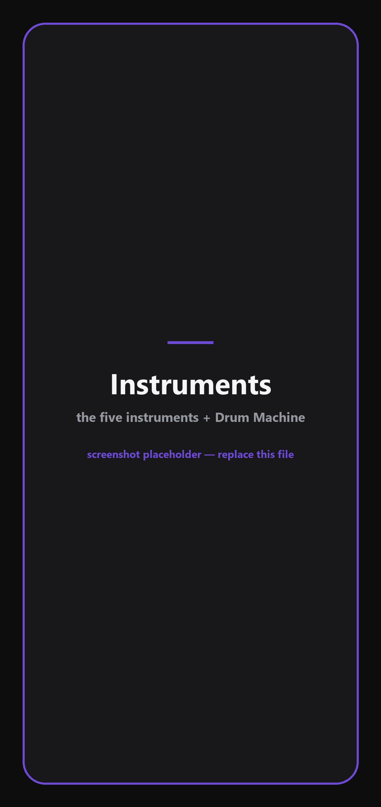
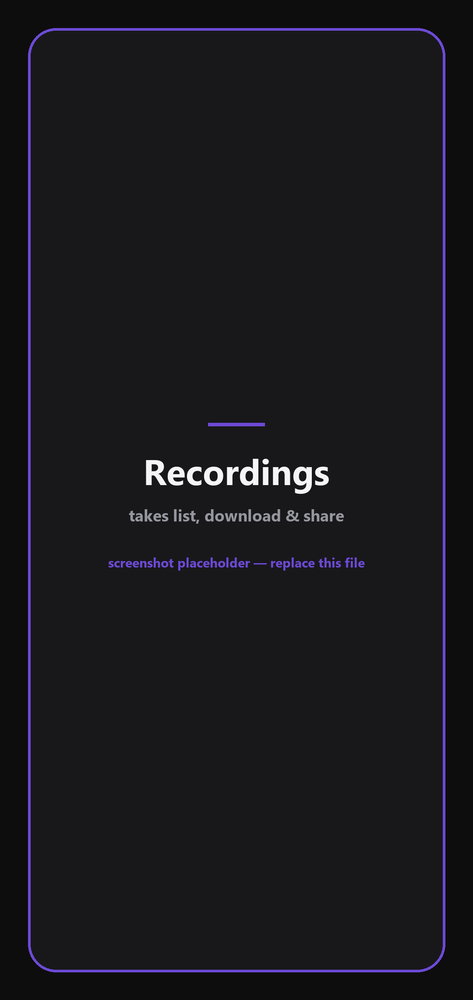
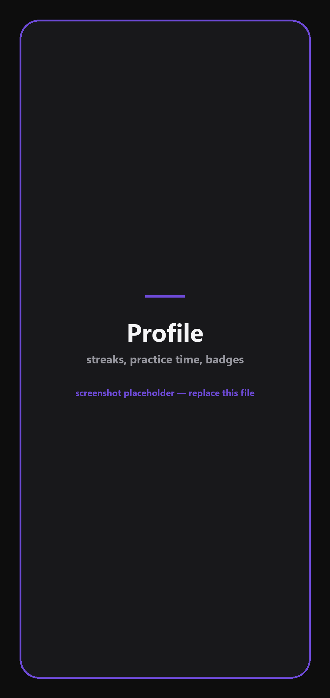
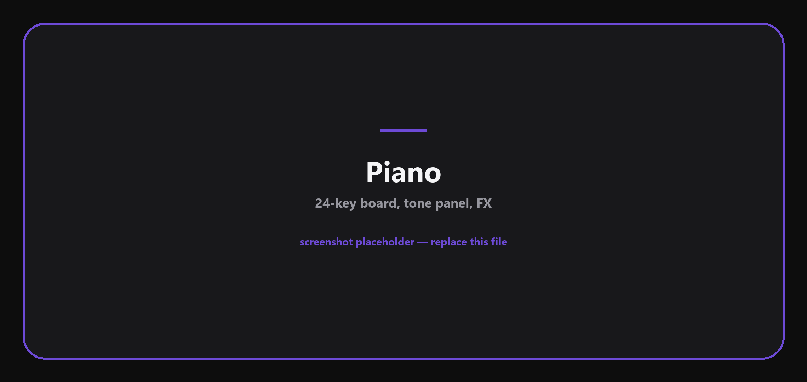
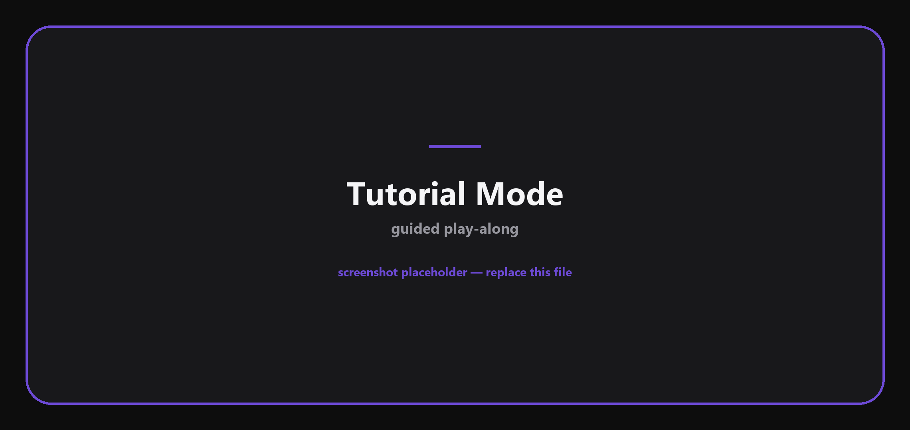
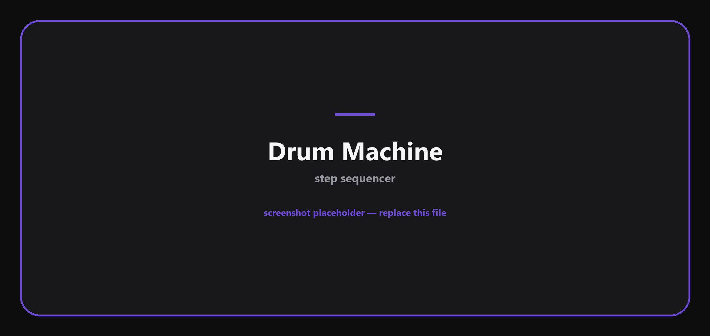
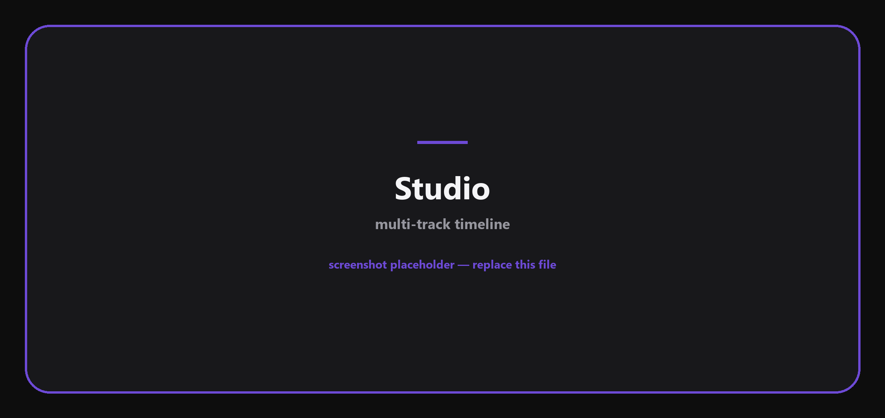

<div align="center">


# BioBand

**Five instruments in your pocket — and a studio to put them together.**

Piano, drums, guitar, violin and pads with real sampled sound, a step-sequenced
drum machine, guided tutorials, multi-track recording, and progress tracking.
Works fully offline.

[](https://github.com/bilalgurkansanli/BioBand/actions/workflows/ci.yml)
[](https://docs.expo.dev/versions/v54.0.0/)
[](https://reactnative.dev)
[](tsconfig.json)
[](LICENSE)

</div>

---

## Demo

<!--
  ─────────────────────────────────────────────────────────────────────────
  DEMO VIDEO — pick whichever is easier:

  1. MP4 (gives a real player, best quality)
     Open a new issue in this repo, drag the .mp4 into the comment box, wait
     for the upload to finish, and copy the `https://github.com/user-attachments/...`
     URL it produces. Paste that URL below **on its own line** — bare, not
     wrapped in markdown link syntax, which is what makes GitHub render a
     player. Then close the issue without submitting it.

  2. GIF (plays inline everywhere, including on mirrors)
     Save it as `docs/demo.gif` and replace this whole block with:
     
  ─────────────────────────────────────────────────────────────────────────
-->

> **📹 Demo video goes here.** The two ways to add it are written in an HTML
> comment in the source of this section.

## Screenshots

<table>
  <tr>
    <td align="center" width="33%"><br><sub><b>Instruments</b></sub></td>
    <td align="center" width="33%"><br><sub><b>Recordings</b></sub></td>
    <td align="center" width="33%"><br><sub><b>Profile &amp; streaks</b></sub></td>
  </tr>
</table>

<table>
  <tr>
    <td align="center" width="50%"><br><sub><b>Piano</b></sub></td>
    <td align="center" width="50%"><br><sub><b>Tutorial Mode</b></sub></td>
  </tr>
  <tr>
    <td align="center"><br><sub><b>Drum Machine</b></sub></td>
    <td align="center"><br><sub><b>Studio</b></sub></td>
  </tr>
</table>

<sub>Those are placeholders. Drop real captures over the files in
<a href="docs/screenshots/">docs/screenshots/</a> — keep the filenames and no
README edit is needed. See
<a href="docs/screenshots/README.md">docs/screenshots/README.md</a>.</sub>

## Features

**Instruments** — Piano (24 keys, C4–B5), Drums, Guitar, Violin and Pads, each
with several voices or kits, its own tone shaping, and sample-accurate playback.
Plus a step-sequenced Drum Machine with pattern save/load.

**Tutorial Mode** — a guided play-along on every instrument. Notes light up in
time with the music; play at your own speed or watch it play itself. Songs are
stored as timed events, so note length and phrasing are real rather than a
uniform metronome grid.

**Bring your own songs** — import a `.mid` file or a JSON chart and it becomes a
playable tutorial. The importer reads the tempo map and time signature, splits
bass from chords, de-jitters human timing, and transposes the piece to fit the
keyboard instead of folding stray notes into the wrong octave.

**Studio** — multi-track timeline with per-track volume, mute/solo, clip
dragging, snap-to-grid, tempo and metronome. Overdub a new take straight from
any instrument, then bounce the mix to a single file.

**Recordings** — every take in one place: play back with a scrubber, rename,
download to a folder you pick, or send it through the system share sheet.

**Progress** — practice streaks, total practice time, badges, and optional
practice reminders.

**Offline-first** — every sample and song ships inside the app. Nothing is
downloaded at runtime, and in guest mode nothing leaves the device. Signing in
with Google or Apple additionally syncs progress and settings through Supabase,
guarded by Postgres Row Level Security.

**Localised** — English, Turkish, German.

## How it works

A few decisions that shaped the codebase. The full write-up is in
[`docs/ARCHITECTURE.md`](docs/ARCHITECTURE.md).

**Notes are scheduled on the audio clock, not on `setTimeout`.**
JavaScript timers drift and stall behind rendering; a song scheduled with them
sounds fine at first and falls apart under load. Instead a 25 ms tick looks
120 ms ahead and hands each note to the audio engine with an absolute start
time, so timing is decided by the audio hardware's clock.
→ [`src/audio/songScheduler.ts`](src/audio/songScheduler.ts)

**Samples are never stretched far.**
Each instrument keeps anchor recordings a few semitones apart and repitches to
the nearest one, so no note is stretched more than about two semitones. Past
that a sampled piano starts to sound like a synthesiser.
→ [`src/instruments/piano/pianoSamples.ts`](src/instruments/piano/pianoSamples.ts)

**Export renders offline, not in real time.**
An instrument take is stored as note events, so exporting it re-renders the
performance through an `OfflineAudioContext` much faster than real time, then
encodes. The encoder is sliced and awaited between blocks — it runs on the same
thread that draws the UI, and a one-shot encode of a long take freezes the app
outright.
→ [`src/audio/offlineBounce.ts`](src/audio/offlineBounce.ts),
[`src/audio/pcmEncode.ts`](src/audio/pcmEncode.ts)

**Songs are transposed whole, never folded.**
The piano exposes 24 keys. A song that wanders outside them is shifted as a
whole so its shape survives; folding individual notes back into range keeps
every pitch "correct" while destroying the melody's contour.
→ [`src/instruments/piano/songs/midiToSong.ts`](src/instruments/piano/songs/midiToSong.ts)

**Instruments warm up before the app opens.**
The first screen is the instrument list, so tapping an instrument has to make
sound immediately. Every engine decodes its samples behind the launch screen
rather than on first focus.
→ [`src/audio/preloadInstruments.ts`](src/audio/preloadInstruments.ts)

## Getting started

### Requirements

- Node.js 20+
- Android Studio or Xcode for the platform you target
- BioBand uses native audio modules, so it needs a **dev client build** — it
  does not run in Expo Go
- Optional: a [Supabase](https://supabase.com) project, only for sign-in and
  cloud sync

### Run it

```bash
git clone https://github.com/bilalgurkansanli/BioBand.git
cd BioBand
npm install
npm run android          # or: npm run ios
```

Without a `.env` the app runs fully in guest mode: every instrument, song,
recording and Studio feature works — only sign-in and cloud sync are disabled.

### Optional: cloud sync

1. Create a Supabase project and run [`supabase/schema.sql`](supabase/schema.sql)
   once in its SQL Editor. That creates the `app_data` table and its Row Level
   Security policies.
2. `cp .env.example .env` and fill in your own values;
   [`.env.example`](.env.example) documents where each one is found.
3. Replace the OAuth client ID in [`app.json`](app.json) (`plugins` →
   `@react-native-google-signin/google-signin` → `iosUrlScheme`) plus the
   `owner` and `extra.eas.projectId` fields with your own.

> OAuth client IDs and the Supabase anon key are public client-side values by
> design — they ship inside every app binary. Access is enforced by Row Level
> Security, not by keeping them secret. Never put a `service_role` key in this
> project.

## Project layout

```
src/
├── audio/            shared audio layer — context, sample bank, scheduler,
│                     offline bounce, encoders, preloading
├── instruments/      one folder per instrument: engine, voices, samples, songs
│   └── shared/       cross-instrument performance and rhythm helpers
├── components/       UI, grouped by instrument and feature
├── screens/          one screen per route
├── hooks/            engine bindings, play-along, recording, orientation
├── storage/          AsyncStorage persistence
├── supabase/         optional cloud sync client
├── profile/          streaks, practice time, badges
├── i18n/             en / tr / de catalogues
└── types/            shared domain types

assets/samples/       the instrument recordings (mp3 / wav)
docs/                 architecture notes and screenshots
supabase/schema.sql   database schema and RLS policies
```

## Scripts

| Command | What it does |
| --- | --- |
| `npm start` | Start the Metro bundler |
| `npm run android` / `npm run ios` | Build and launch a dev client |
| `npm run typecheck` | `tsc --noEmit` |
| `npm run lint` | ESLint |
| `npm run check` | Typecheck + lint — the same pair CI runs |
| `npm run doctor` | `expo-doctor` project health check |

## Known trade-offs

Things that are true today, so you don't have to discover them the hard way:

- **Launch decodes a lot of audio.** All five engines warm up before the app
  opens — around 7 minutes of audio across 116 files, roughly 79 MB in memory.
  Several sample tails run far longer than any envelope reaches, so there is
  real headroom here.
- **Instrument-mode exports are MP3, not MP4.** Microphone takes are already
  AAC-in-MP4 and are exported as-is, but a rendered instrument take has to be
  encoded and there is no AAC encoder available in JavaScript. True MP4
  everywhere needs a small native module.
- **No automated test suite yet.** Audio behaviour has been checked by
  measurement — rendering charts to PCM and asserting timing, contour and range
  in Node — rather than by a committed suite. Contributions welcome.
- **Long MIDI imports are truncated** at a fixed note cap without telling the
  user.

## Contributing

Issues and pull requests are welcome — [CONTRIBUTING.md](CONTRIBUTING.md) covers
setup, what CI checks, and what makes a change easy to review. By taking part
you agree to the [Code of Conduct](CODE_OF_CONDUCT.md).

Found a security problem? Please follow [SECURITY.md](SECURITY.md) rather than
opening a public issue.

## Privacy

BioBand keeps your recordings and progress on your device. Nothing is uploaded
unless you sign in. Full policy: [PRIVACY.md](PRIVACY.md).

Signed in and want out? Profile → Settings → Delete account removes everything
immediately; [`docs/account-deletion.md`](docs/account-deletion.md) covers what
is deleted and how to request it without installing the app.

## Credits

Public-domain sheet music for the classical tutorials comes from the
[Mutopia Project](https://www.mutopiaproject.org/). Instrument samples are
bundled with the app; per-instrument notes live alongside them in
[`assets/samples/`](assets/samples).

## License

[MIT](LICENSE) © Bilal Gürkan Şanlı
